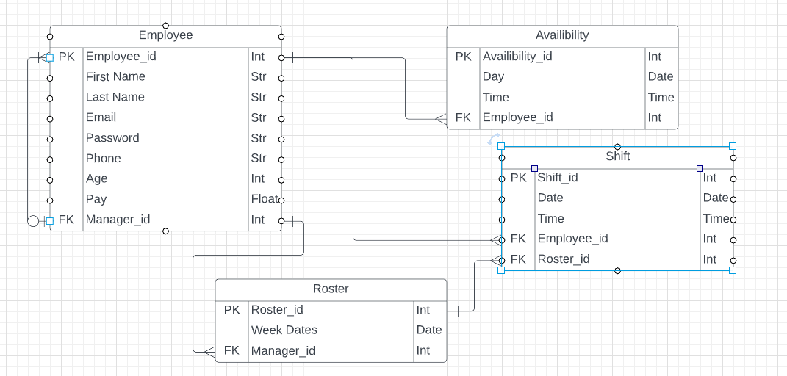
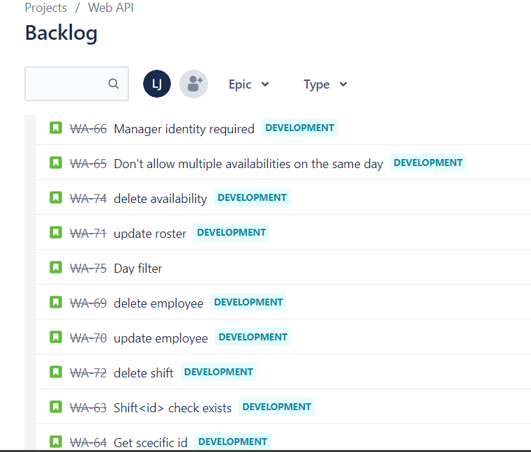

## Identification of the problem  
This app should make it easier for management to make shift schedules and keep track of their employees, availabilities.  

## Why is it a problem that needs solving?  
It can be difficult for management to keep up with scheduling when there are a large amount of employees and if there are multiple managers working on organising rosters.  

## Why have you chosen this database system.  
I chose postgres as the DBM mainly because it is the one I'm already familiar with. It has a wider range of features compared to other DBMS and supports python. Since it is popular, it has a good amount of documentation and learning materials available. However as it is so highly customizable, it might take a little more work on your own to troubleshoot if what you are trying to do is less common. A drawback to having more advanced features available is that it runs a bit slower.  

## Identify and discuss the key functionalities and benefits of an ORM  
An ORM allows you to write database queries using the object-oriented paradigm of your preferred programming language. The benefits are you can use a language you are already familiar with, you don't need any sql knowlege, switching between dbms is easy, it can give the app a more effective design pattern and testing and refactoring is easier.  

# Endpoints  
## AUTHORIZATION  
ADD EMPLOYEE  
auth/regiter - method=POST  
Registeres new employee login, checks email doesn't exist and creates access token.  
Postman fields:  
{  
    "first_name" : "Jamie",  
    "last_name" : "Tompson",  
    "email" : "jamie@gmail.com",  
    "password" : "12345678",  
    "phone" : "04123456789",  
    "age" : "21",  
    "pay" : "23.50",  
    "manager": true  
}  

LOGIN  
auth/login - method=POST  
Checks email exists, Checks password is correct and creates access token.   
Postman fields:  
{  
    "email" : "sam@gmail.com",  
    "password" : "12345678"  
}  

UPDATE EMPLOYEE  
auth/<int:id> - method=PUT  
Checks employee exists, updates employee.  

DELETE EMPLOYEE  
auth/<int:id> - methods=DETETE  
Checks manager identity, checks employee exists, deletes employee.  

## EMPLOYEES 

SHOW ALL EMPLOYEES  
employees/ - method=GET  
Checks manager identity,
Shows list of all employees.  

SHOW SPECIFIC EMPLOYEE  
employees/<int:id> - methods=GET  
Checks manager identity,
Gets employee id, checks it exists, shows employee.  
  
SHOW ALL AVAILABILITIES, OR FILTER BY DAY/EMPLOYEE_ID  
employees/availabilities - method=GET  
If no query string shows all availabilities.
employees/availabilities?day=Monday - method=GET  
Filters by day  
employees/availabilities?employee_id=1 - method=GET  
Filters by employee_id  

NEW AVAILABILITY FOR SIGNED IN EMPLOYEE   
employees/<int:employee_id> - method=POST  
Checks employee exists, adds new availability to employee.   
{  
    "day" : "Monday",  
    "start": "10:30:00",  
    "end": "15:00:00"  
}  
  
## ROSTERS

SHOW ALL ROSTERS  
rosters/ - method=GET  
Shows all rosters.  

SHOW SPECIFIC ROSTER  
rosters/<int:id> - methods=GET  
Checks roster exists, shows roster.  

ADDS ROSTER  
rosters/ - method=POST  
Checks manager identity  
Adds new roster.  
{  
    "start_date" : "2022-11-19"  
}  

UPDATES ROSTER  
rosters/<int:id> - methods=PUT  
Checks manager identity, updates roster  

DELETES ROSTER  
rosters/<int:id> - methods=DELETE  
Checks manager identity, gets roster id, checks it exists, deletes roster.  

## SHIFTS  

SHOW ALL SHIFTS   
shifts/ - methods=GET  
Shows all shifts.  

SHOW SPECIFIC SHIFT  
shifts/<int:id> - methods=GET  
Check shift exists, shows shift  

ADD NEW SHIFT  
shifts/ - methods=POST  
Check manager identity, 
Adds new shift.  
Postman fields:  
{  
    "date" : "2022-11-19",  
    "start_time": "10:30:00",  
    "end_time": "15:00:00",  
    "roster_id": 1,  
    "employee_id": 1  
}
  
UPDATE SHIFT  
shifts/<int:id> - methods=PUT  
Check manager identity, checks shift  exists, updates shift. 

DELETE SHIFT  
shifts/<int:id> - methods=DELETE  
Check manager idnetity, check shift exists, deletes shift.  

## ERD
  

## Third party services  
Web frameword - Flask  
Password hashing - Flask-Bcrypt  
Tokens - Flask-JWT-Extended  
ORM - Flask-SQLAlchemy  
Object serialization - flask-marshmallow  
Error handling - psycopg2-binary  

## Describe your projects models in terms of the relationships they have with each other  
One employees can make many availabilities and many shifts.
Many managers can make many rosters, and one roster can have many shifts.  

## Discuss the database relations to be implemented in your application  
The employee model will hold all information on the employee including thier password for authentication. Employees have relationships to the availability model, which stores the employees availability information and the shifts model, which stores shifts they have been assigned by an employee with manager identity. The roster model stores only the stating date of a week, shifts will be related to this model in order to group them into specific weeks.  

## Describe the way tasks are allocated and tracked in your project  
Used Jira to track tasks, starting out with basic functionality I wanted to include and basic steps to take when developing (e.g. adding schemas), then added new more specific tasks as progress was mande.   
  